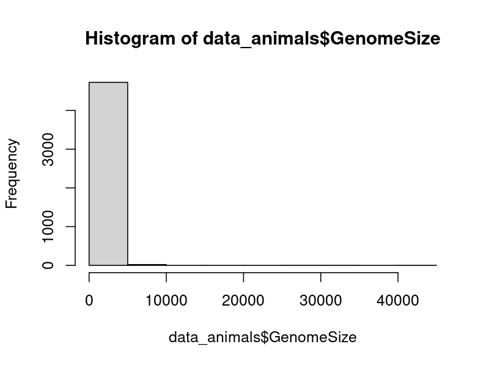
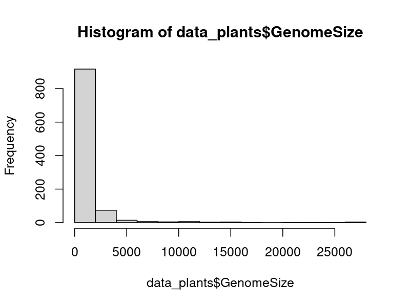
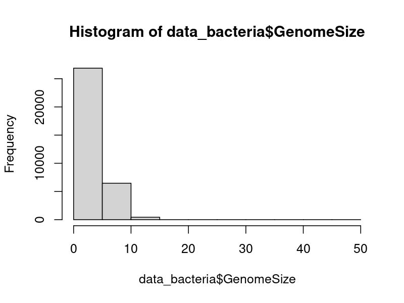
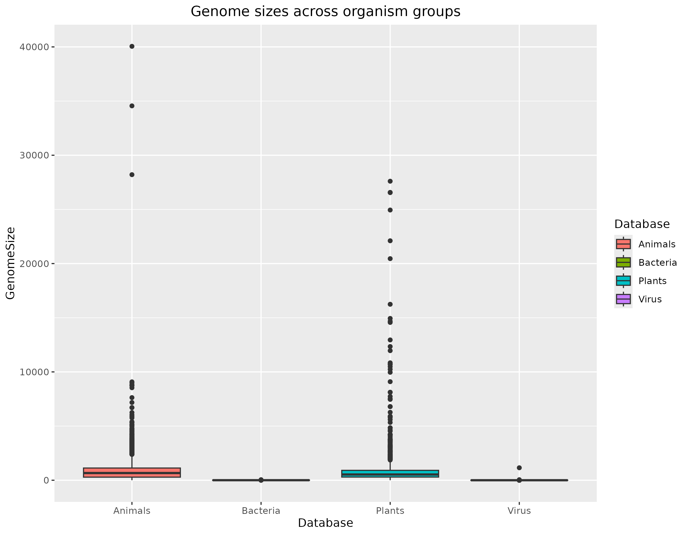

---
### BEGIN-Of-YAML-Block ###
#
## ######################################################################################
##
##   README_BScBICG2425_exercise00_Izquierdo_Jan.md
##
##   A LaTeX-extended MarkDown template for BScBI-CG practical exercise submissions.
##
## ######################################################################################
##
##                 CopyLeft 2024 (CC:BY-NC-SA) --- Josep F Abril
##
##   This file should be considered under the Creative Commons BY-NC-SA License
##   (Attribution-Noncommercial-ShareAlike). The material is provided "AS IS",
##   mainly for teaching purposes, and is distributed in the hope that it will
##   be useful, but WITHOUT ANY WARRANTY; without even the implied warranty
##   of MERCHANTABILITY or FITNESS FOR A PARTICULAR PURPOSE.
##
## ######################################################################################
#
# The current execise number
thyexercise: 00
#
# title-meta is title string without any LaTeX format to be used as pdftitle, part of emails subject...
title-meta: BScBI-CG Exercise 00
#
# title is the big title for the cover page, fully LaTeX formated to fit into a shortstack command...
title: |
  \textsc{BScBI-CG}
  \vskip 1.25ex \textsc{Practical 0}
  \vskip 1.25ex \textsc{report}
#subtitle:
#
# runtitle is the running header or footer, used i.e. by fancyheadings...
runtitle: |
  BScBI-CG Exercise 00 Report
#
# author-meta sets the pdfauthor variable...
author-meta: !!str 'Jan Izquierdo @ BScBI Computational Genomics'
#
# authors to appear on the title page...
author:
- name: Jan Izquierdo
  myemail: jan.izquierdo
  mydomain: alum.esci.upf.edu
# you can follow the example below
# we need to define email as two fields (user/domain) to avoid parsing email by YAML
# - name: Josep F Abril
#   myemail: jabril   #
#   mydomain: ub.edu  # the real complete email address was in this case: jabril@ub.edu
#
# authorshort defines a brief list of authors for headings, i.e.: Abril, JF
authorshort: Izquierdo, J
#
# template formating variables...
papersize: a4paper
fontsize: 10pt
geometry: margin=1.5cm
toc: true
lof: true
lot: true
colorlinks: true
urlcolor: blue
citecolor: green
linkcolor: red
#
# LaTeX definitions (available for the main document)
further-defs:
-  \def\CGVC{\href{https://aula.esci.upf.edu/course/view.php?id=8516}{Computational Genomics Virtual Campus at ESCI}}
#
### End-Of-YAML-Block ###
---

\begin{comment}
The \texttt{comment} \LaTeX\ environment allow us to
include any piece of text, code, etc, but it wil not be included into
the final PDF report when compiling the \texttt{MarkDown} file. You
can open/close one of such environments at any time if you need them.
\end{comment}


# Introduction

We are going to reuse a set of existing `MarkDown` report templates to
define the protocols to be run on each practical session. This first
document will allow us to describe the different sections it contains,
highlighting the major blocks its made of. We will also use it to
provide applied examples of the `MarkDown` and \LaTeX\ syntax; for
both we will introduce new features on each new practical session. You
can read the [`MarkDown` syntax guide](http://daringfireball.net/projects/markdown/syntax#link),
as well as from the manual pages (just type `man pandoc` and/or `man
pandoc_markdown` if you have installed this software tool).


## Objectives

* We will practice how to report the commands and the results required
  to solve the practical exercises, using a text file, this report of
  course, and the `MarkDown` syntax. Some enhancements using \LaTeX\
  will be also illustrated.
* The main goal is to understand the structure and logic of the report
  document, what can be found on each section, how code blocks are
  defined, and how to process it for submission to the \CGVC.
* This exercise will be useful to check that all required packages and
  libraries are working properly in order to generate the practical
  reports for the continued assessment of the subject.
* At the same time, if those commands can run on our computers, we
  will have some commands already installed and available for the
  forthcoming practical sessions.


## Prerequisites

### Installing required software

For this practical we must ensure that at least `pandoc` and
`pdflatex` commands are running smoothly over our report files. You
probably may need to install the following packages before working on
anything else.

#### __Linux__ users:

You must submit an exercise report for each practical as two single
files, a `MarkDown` text file and a `PDF` compiled from that
`MarkDown` file. In order to run such procedure, we must ensure that
we have the software tools and the corresponding dependencies. This
has to be done for the first exercise only, as you will have those
tools already available for future compilations of the other
exercises. The command below will install those tools:

```{.sh}
sudo apt-get install pandoc \
                     texlive-latex-recommended \
                     texlive-latex-extra \
                     texlive-fonts-recommended

# getting the latest version from repository
#     https://github.com/jgm/pandoc/releases/latest
# for a Debian-based linux distribution you can run those two commands:
wget https://github.com/jgm/pandoc/releases/download/3.1.8/pandoc-3.4-1-amd64.deb
sudo dpkg -i pandoc-3.4-1-amd64.deb
```

When using `pandoc` version greater than `2.x` we will be able to
apply further macros and tags on our report file (like embed `LaTeX`
blocks). In case you want to play with \LaTeX\, I will recommend you
to install the complete set with this command (it takes some time to
download them though, as you may get the packages and many
dependencies):

```{.sh}
sudo apt-get install texlive-full \
                     texlive-fonts-recommended \
                     texlive-fonts-extra
```

You can also install optional packages, such a text editor with
programming facilities and extensions, like `emacs` or `geany` (you
can also use `sublime`, `atom`, `gedit`, ...):

```{.sh}
sudo apt-get install emacs geany vim vim-gtk
```

Another example of downloading source code and compiling it (**NOT
NEEDED if you are using CONDA ENVIRONMENT**).

```{.sh}
git clone https://github.com/kimrutherford/EMBOSS.git
cd EMBOSS
./configure --prefix=/usr/local/install/EMBOSS
make
make check
make install
```

Further instructions will be given on the templates in case a
practical requires that you install further software...

#### __MacOS__ users:

MacOS users can try to install ports for the software tools from
`homebrew` or `conda` repositories. Here we have a brief summary of
such commands. `Homebrew` is a package manager for __MacOS__; it also
has a port for __Linux__, known as `Linuxbrew`. To install this
package manager, just copy the following command and paste it to a
Terminal window:

```{.sh}
# setting up brew tool and its repositories
/bin/bash -c "$(curl -fsSL https://raw.githubusercontent.com/Homebrew/install/master/install.sh)"
# OLD ruby installer:
## /usr/bin/ruby -e "$(curl -fsSL https://raw.githubusercontent.com/Homebrew/install/master/install)"
```

A list of all the available packages (known as *formulae*) is found at
[formulae.brew.sh](https://formulae.brew.sh). Examples of `brew`
command to install the `EMBOSS` or the `pandoc` are shown here:

```{.sh}
# Getting EMBOSS installed with brew
brew search emboss
# homebrew/science/emboss  #<-- check the output of the previous command to use in your system
brew install homebrew/science/emboss

# Getting pandoc installed with brew
brew install pandoc
# this is optional
brew install pandoc-citeproc
# you need this to typeset PDFs with LaTeX
brew install librsvg python homebrew/cask/basictex

# You can also download the pandoc MacOS instaler from the following URL:
# https://github.com/jgm/pandoc/releases/download/3.4/pandoc-3.4-x86_64-macOS.pkg
```

#### Using `conda/mamba` environments:

Yet another way to install the software required to complete the
exercises is to use `conda` environments. You can install `conda`
following the instructions from [this
link](https://conda.io/projects/conda/en/latest/user-guide/install/index.html);
you can also use `mamba` instead, which is a compact and faster
implementation of `conda`, from the instructions at [this
link](https://github.com/conda-forge/miniforge#install). Once you have
one of those environment managers installed, you can follow the
commands in the next code block to create the `BScBI-CG2425_exercises`
environment and activate it.

```{.sh}
#
# If you have conda instead of mamba already installed on your system
# you can just replace 'mamba' by 'conda' on the commands below:
#
mamba env create --file environment.yml

# Now you can run the tools installed on that environment by activating it:
mamba activate BScBI-CG2425_exercises

# Remember that each time you deactivate a conda environment
# all shell variables defined inside will be lost
# (unless they were exported before activating the conda environment).
# Anyway, you can reload project vars with:
source projectvars.sh

# To return to the initial terminal state, you must deactivate the environment:
mamba deactivate
```

You can review the contents of the environment YAML file at the
Appendices (see section \ref{prg:environmentYML} on page
\pageref{prg:environmentYML}),

#### Using `docker` containers:

If you have a MacOS, a MS-Windows OS, or you cannot deal with the
software install commands from the previous section, you can even use
the container we provide for the course, which has all those tools
already packed and ready to be used.

```{.sh}
# You must install docker server to run containers in your system.
# Follow the instructions from the URLs below
#    https://docs.docker.com/
#          https://docs.docker.com/install/linux/docker-ce/debian/
#          https://docs.docker.com/docker-for-mac/install/
#          https://docs.docker.com/docker-for-windows/install/

# Download the tarball from the course materials (take care, it's a 3.5GB file)
wget https://compgen.bio.ub.edu/~jabril/teaching/BScBI-CG2425/MScGGBIA_docker.tar.gz

# Then, get the tarball unzipped on your machine:
gunzip -vc '/mounted_device_path/MScGGBIA_docker.tar.gz' > ~/MScGGBIA_docker.tar

#  Upload the container to your docker server:
docker load -i ~/MScGGBIA_docker.tar

# Change directory on the current terminal/shell to the exercise folder.

# Run this docker with:
docker run --rm -ti -e WD="$PWD" -v /home:/home   mscggbia    # on a Linux   machine
docker run --rm -ti -e WD="$PWD" -v /Users:/Users mscggbia    # on a Mac     machine
docker run --rm -ti -e WD="$pwd" -v c:/Users:/Users mscggbia  # on a Windows machine

# Now you will be inside the container on the root folder,
# so you have to change to the working directory:
cd $WD
# Then you are ready to play with commands at the exercise folder.
source projectvars.sh
runpandoc
```


### Initializing the main report files

In a `bash` command-line terminal, create a folder for all the
practicals on this subject and change working dir to that folder:

```{.sh}
mkdir practicals
cd practicals
```

Then, we need to download the exercise tarball (the `*.tgz` file) from
the \CGVC\ into that folder, unpack such file, modify the files
accordingly to the user within the exercise folder, and set it as the
current working directory for the rest of the practical session...

```{.sh}
# Uncompress and unpack the exercise files from tarball
#
# NOTE: If you are reading this, you probably have already done this step.
#
tar -zxvf BScBI_CG2425_exercise_00.tgz

# Move into the new extracted folder
cd exercise_00

# Rename the MarkDown README_*.md file by replacing NAME and SURNAME strings
# with your "NAME" and "SURNAME" with the following command
mv -v README_BScBICG2425_exercise00_SURNAME_NAME.md \
      README_BScBICG2425_exercise00_YourSurname_YourName.md

# Open exercise files using your text editor of choice
# (for instance vim, emacs, gedit, sublime, atom, ...);
emacs  projectvars.sh \
       README_BScBICG2425_exercise00_YourSurname_YourName.md

# Fix "NAME" and "SURNAME" placeholders on those files
# and save the changes before continuing.

# Load the bash definitions from projectvars.sh
source projectvars.sh
# for instance the variable WDR was set to the absolute path
# to current exercise working directory
echo $WDR

# Now you are ready to start the practical by looking at
# the MarkDown file for further instructions to run
# the corresponding code blocks.

# Each time you include your answers/code/results
# on the README file, you can compile it into PDF.
# So that, let's tests if we can compile the modified MarkDown document.
# You probably must install some dependencies yet...
runpandoc
```

Again, remember to submit both files, the MD and the PDF, to the
\CGVC\, once errors/warnings have been fixed, all the requested task
have been completed, and you have discussed your results on the
corresponding sections.

If you have succeeded on the software installation step, then you can
start with the analyses provided on the next section... May the shell
be with you...

\newpage

# Genome properties Comparison

As an example of analysis we can record in a `MarkDown` report file,
we are going to plot the distribution of lengths for a set of
eukaryotic organisms.

## Datasets

We already have a file in tabular format in the `stats` folder, where
we have saved some whole-genome properties of several eukaryotic
species. The initial `genomes.csv` file was downloaded from the
[Genome Information by Organism online
resource](https://www.ncbi.nlm.nih.gov/genome/browse#!/overview/) at
[NCBI-Genomes database
division](https://www.ncbi.nlm.nih.gov/genome/). The file has info
about species, their taxonomic group, the genome size in
mega-basepairs (Mbp), number of completed chromosomes and organelles,
as well as the number of available assemblies at NCBI, for a total of
47,345 species.

## Basic data checks from command-line

We can take a look to the `genomes.csv` file contents with some basic
__Unix__ comands. We will filter out some fields and records, then we
will upload the processed table into an R shell and we will transform
the data into few summary plots.

```{.sh}
## listing directory contents
ls -alFhrt stats/
# drwxr-xr-x 2 jabril users 4.0K Sep 28 14:21 ./
# drwxr-xr-x 6 jabril users 4.0K Sep 28 14:13 ../
# -rw-r--r-- 1 jabril users 5,9M Sep 28 14:15 genomes.csv

## counting number of lines, words and chars of a file
wc stats/genomes.csv
#  72068  245486 6143707 stats/genomes.csv
# this means that the file has 72068 lines;
# the first one defines the column names,
# thus there are 72067 records with genomes information

## looking a the first two lines of the tabular file in csv format
head -2 stats/genomes.csv
# #Organism Name,Organism Groups,Size(Mb),Chromosomes,Organelles,Plasmids,Assemblies
# "'Brassica napus' phytoplasma","Bacteria;Terrabacteria group;Tenericutes",0.743598,0,0,0,1

## filtering out relevant information
gawk 'BEGIN{ FS=","; OFS="\t"; }
  { gsub(/"/, "", $2);
    split($2, t, ";");
    print $1, t[1], t[2], $3, $4;
  }' stats/genomes.csv \
   > stats/genomes.tbl

## looking a the first two lines of the new tabular file in tsv format
head -2 stats/genomes.tbl
# #Organism Name	Organism Groups		Size(Mb)	Chromosomes
# "'Brassica napus' phytoplasma"	Bacteria	Terrabacteria group	0.743598	0

# just focus on animal genomes
gawk 'BEGIN{ FS=OFS="\t"; }
      $2 == "Eukaryota" && $3 == "Animals" {
        print $0;
      }' stats/genomes.tbl \
       > stats/genomes.animals_only.tbl

# yet another counting step
wc stats/genomes.*
#  72068   245486  6143707 stats/genomes.csv
#  72068   514828  4445887 stats/genomes.tbl
#   4748    28521   236574 stats/genomes.animals_only.tbl
```

## Visualizing the analysis

Let's explore the distribution of genome lengths in animal genomes. By
running `R` command, we enter in the `R` shell interpreter, which
understands `R` commands of course.

```{.sh}
R
#
# R version 4.1.2 (2021-11-01) -- "Bird Hippie"
# Copyright (C) 2021 The R Foundation for Statistical Computing
# Platform: x86_64-pc-linux-gnu (64-bit)
#
# R is free software and comes with ABSOLUTELY NO WARRANTY.
# You are welcome to redistribute it under certain conditions.
# Type 'license()' or 'licence()' for distribution details.
#
# R is a collaborative project with many contributors.
# Type 'contributors()' for more information and
# 'citation()' on how to cite R or R packages in publications.
#
# Type 'demo()' for some demos, 'help()' for on-line help, or
# 'help.start()' for an HTML browser interface to help.
# Type 'q()' to quit R.
```

Now, we must load the tabular data into a variable.

```{.r}
# if we have an uncompresed tabular file
data_animals <- read.table("stats/genomes.animals_only.tbl",
                    header=FALSE, comment.char='#',
                    col.names=c("SpeciesName","Superkingdom","TaxonGroup",
                                "GenomeSize","ChromNum"));

# just checking the data structure
head(data_animals, 4)
#             SpeciesName Superkingdom TaxonGroup GenomeSize ChromNum
# 1    Abisara bifasciata    Eukaryota    Animals    332.742        0
# 2         Abramis brama    Eukaryota    Animals   1067.400       25
# 3  Abrostola tripartita    Eukaryota    Animals    381.057       31
# 4 Abscondita terminalis    Eukaryota    Animals    499.653        0
```

Let's calculate some stats on the dataset.

```{.r}
options(width=180)
summary(data_animals)
#  SpeciesName        Superkingdom        TaxonGroup          GenomeSize         ChromNum
#  Length:4748        Length:4748        Length:4748        Min.   :    0.0   Min.   : 0.000
#  Class :character   Class :character   Class :character   1st Qu.:  285.2   1st Qu.: 0.000
#  Mode  :character   Mode  :character   Mode  :character   Median :  663.2   Median : 0.000
#                                                           Mean   :  935.3   Mean   : 5.006
#                                                           3rd Qu.: 1126.7   3rd Qu.: 0.000
#                                                           Max.   :40054.3   Max.   :99.000
```

Now, let's make an histogram of total lengths for the animal genomes:

```{.r}
png(file="images/genome_length_animals.png");
hist(data_animals$GenomeSize);
dev.off();
```





## Further analyses

__IMPORTANT__ You can provide here the `bash` and `R` commands to
generate the genome sizes histograms for plants, bacteria (archea not
included), and viruses. If you were able to perform and complete that
task, you can play with the data after that and provide box-plots by
taxonomic group showing the distribution of the genome sizes
side-by-side.

```{.sh}
#Plant genomes
gawk 'BEGIN{ FS=OFS="\t"; }
      $2 == "Eukaryota" && $3 == "Plants" {
        print $0;
      }' stats/genomes.tbl \
       > stats/genomes.plants_only.tbl

#Bacteria genomes
gawk 'BEGIN{ FS=OFS="\t"; }
      $2 == "Bacteria"{
        print $0;
      }' stats/genomes.tbl \
       > stats/genomes.bacteria_only.tbl
#Terrabacteria group -> Terrabacteria_group
cut -f3 -d$'\t' genomes.bacteria_only.tbl |grep " "
#find pattern of " "group and unclassified" " among many others, use find and replace to set _group and unclassified_

#Virus genomes
gawk 'BEGIN{ FS=OFS="\t"; }
      $2 == "Viruses"{
        print $0;
      }' stats/genomes.tbl \
       > stats/genomes.virus_only.tbl
       
cut -f3 -d$'\t' genomes.virus_only.tbl |grep " "
#find pattern of unclassified" " and " "viruses, use find and replace to set unclassified_ and _viruses
```

R for plants
```{.r}
#Plant genome plots
data_plants <- read.table("stats/genomes.plants_only.tbl",
                    header=FALSE, comment.char='#',
                    col.names=c("SpeciesName","Superkingdom","TaxonGroup",
                                "GenomeSize","ChromNum"));
png(file="images/genome_length_plants.png");
hist(data_plants$GenomeSize);
dev.off();
```





R for bacteria
```{.r}
#Bacteria genome plots
data_bacteria <- read.table("stats/genomes.bacteria_only.tbl",
                    header=FALSE, comment.char='#',
                    col.names=c("SpeciesName","Superkingdom","TaxonGroup",
                                "GenomeSize","ChromNum"));
#As there were parts that created errors, we used a bash command to fix the data
png(file="images/genome_length_bacteria.png");
hist(data_bacteria$GenomeSize);
dev.off();
```





R for virus
```{.r}
#Virus genome plots
data_virus <- read.table("stats/genomes.virus_only.tbl",
                    header=FALSE, comment.char='#',
                    col.names=c("SpeciesName","Superkingdom","TaxonGroup",
                                "GenomeSize","ChromNum"));
#As there were parts that created errors, we used a bash command to fix the data
png(file="images/genome_length_virus.png");
hist(data_virus$GenomeSize);
dev.off();
<div style="text-align: center;">
  
</div>
```


R boxplots
```{.r}
library(dplyr)
library(ggplot2)
data_animals$Database<-"Animals"
data_plants$Database<-"Plants"
data_bacteria$Database<-"Bacteria"
data_virus$Database<-"Virus"
data_joint <- bind_rows(data_animals, data_plants, data_bacteria, data_virus)
ggplot(data=data_joint, aes(x=Database, y=GenomeSize, fill=Database))+
  geom_boxplot()+ggtitle("Genome sizes across organism groups")+theme(plot.title = element_text(hjust = 0.5))
ggsave(file="images/genome_boxplot_comparison.png", width = 9, height = 7)
```





# Discussion
\label{sec:discussion}

__IMPORTANT__ Discuss your results here (around 300 words). And
remember to include in the Appendices section (see page
\pageref{sec:appendices}), any extra script you wrote from this
exercise `bin` folder using the `loadfile` macro.

From the histograms of each individual group we can see that there is a high frequency of short genome sizes in all the organism groups. In the box plots we can also observe that the eukaryotes (plants and animals) have larger genome sizes than bacteria and virus. It can also bee seen that among all the groups plants are the ones that have the highest frequency of large genomes, however the largest genome sizes belong to animals.

(https://en.wikipedia.org/wiki/Bacterial_genome)

\clearpage

# Appendices
\label{sec:appendices}

## Software

We have used the following versions:

```{.sh}
uname -a
# Linux aleph 5.15.0-117-generic #127-Ubuntu SMP
# Fri Jul 5 20:13:28 UTC 2024 x86_64 x86_64 x86_64 GNU/Linux

R --version
# R version 4.3.1 (2023-06-16) -- "Beagle Scouts"
# Copyright (C) 2023 The R Foundation for Statistical Computing
# Platform: x86_64-conda-linux-gnu (64-bit)

wget --version
# GNU Wget 1.21.2 built on linux-gnu.

pandoc --version
# pandoc 3.1.3
# Features: +server +lua
# Scripting engine: Lua 5.4

mamba --version
# mamba 1.4.2
# conda 23.3.1
```


## Supplementary files
\label{sec:supplfiles}


### `conda` environment dependencies for the exercise

\loadfile{environment.yml}{environment.yml}{prg:environmentYML}


### Project specific scripts

\loadfile{an\_script\_example.pl}{bin/an_script_example.pl}{prg:scriptexamplePERL}


### Shell global vars and settings for this project

\loadfile{projectvars.sh}{projectvars.sh}{prg:projectvarsBASH}


## About this document

This document was be compiled into a PDF using `pandoc` (see
`projectvars.sh` from previous subsection) and some `LaTeX` packages
installed in this linux system. `synaptic`, `apt-get` or `aptitude`
can be used to retrieve and install those tools from linux
repositories. As the `raw_tex` extension has been provided to the
`markdown_github` and `tex_math_dollars` formats, now this document
supports inline \LaTeX\ and inline formulas!

You can get further information from the following links about the
[Mark Down syntax](http://daringfireball.net/projects/markdown/syntax#link),
as well as from the manual pages (just type `man pandoc` and/or `man
pandoc_markdown`).
